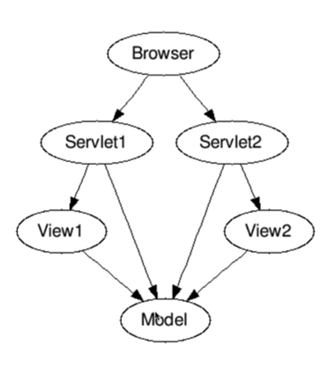

# Spring Boot Application Server Architectures

## Model 1 Architecture

* All code in Views(JSPs)
  * View logic
  * Flow logic
  * Queries to databases
* Disadvantages
  * Very complex JSPs
  * Zero separation of concern

## Model 2 Architecture

* How about separating concerns
  * Model: Data to generate the views
  * View: Show information to user
  * Controller or servlet: Control the flow
* Advantage: Simpler to maintain
* Concern: Where to implement common features  to all controllers?

## Model 2 - Front Controller Architecture

* Concept: All requests flow into a central Controller called as **Front Controller**
* Front Controller controls flow to Controllers and Views
* Common features can be implemented in the front Controller

## Spring MVC Front Controller - Dispatcher Servlet

* Receives HTTP Request
* Processes HTTP Request
  * Identifies correct Controller method
    * Based on request url
  * Executes Controller method
    * Returns Model and View name
  * Identifies correct View
    * Using ViewResolver
  * Executes view
* Returns HTTP Response